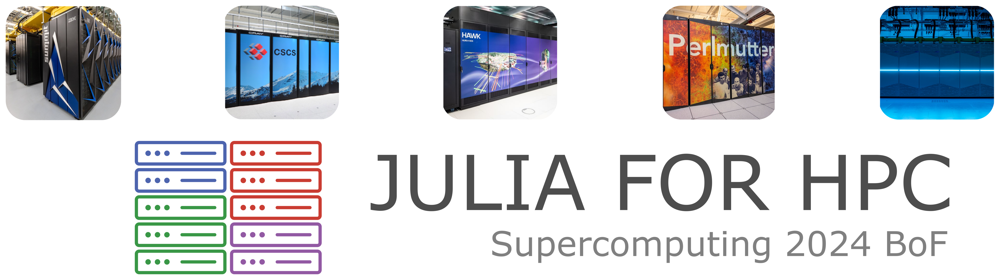

# Julia for HPC Birds of a Feather session @ SC25

This repository contains the brief talks presented during the the "[Julia for HPC](https://sc25.conference-program.com/presentation/?id=bof116&sess=sess480)" Birds of a Feather session at the [SuperComputing25](https://sc25.supercomputing.org/) (SC25) conference held in St. Louis (Missouri, USA) on Thursday, 20 November 2025 at 12:15pm - 1:15pm CST

## The Julia Language for Productive High-Performance Computing Tutorial

This year we will also host a [Tutorial at SC25](https://github.com/JuliaParallel/julia-hpc-tutorial-sc25).

## Community

* The Julia Language, and the Julia for HPC communities are incredibly welcoming, for more information, please check out the [Julia Community Pages](https://julialang.org/community/), the [Julia Discourse](https://discourse.julialang.org/), and the [Julia Parallel](https://juliaparallel.org/) community.
The Julia for HPC community meets monthy on Zoom.

* This is an excellent intro-level course on using Julia in Scientific Computing: [Solving PDEs in parallel on GPUs with Julia](https://pde-on-gpu.vaw.ethz.ch/)

## Agenda

| Time                | Speakers                     | Title                            |
|---------------------|------------------------------|----------------------------------|
| 12:15pm - 12:20pm   | Mosè Giordano (UCL)          |  Introduction       |
| 12:20pm - 12:25pm   | Patrick Diehl (LANL)         | |
| 12:25pm - 12:30pm   | Philip Fackler (ORNL)        | |
| 12:30pm - 12:35pm   | Jim Garrison (IBM)           | |
| 12:35pm - 12:40pm   | Roman Lee (NERSC)            | |
| 12:40pm - 12:45pm   | David Krasowska (NU)         | |
| 12:45pm - 1:15pm    | Everyone                     | Discussion |

Discussions moderated by Mosè Giordano (UCL), and William F Godoy (ORNL).

### Panelists

* Patrick Diehl (Los Alamos National Laboratory)
* Philip Fackler (Oak Ridge National Laboratory)
* Jim Garrison (IBM)
* Roman Lee (NERSC, Berkeley National Laboratory)
* David Krasowska (Northwestern University)

#### Moderator

* Mosè Giordano (UCL)

### Organizers

* Mosè Giordano (UCL)
* Rabab Alomairy (MIT)
* William Godoy (ORNL)
* Johannes Blaschke (LBNL)
* Pedro Valero-Lara (ORNL)
* Pengfei Ding (LBNL)
